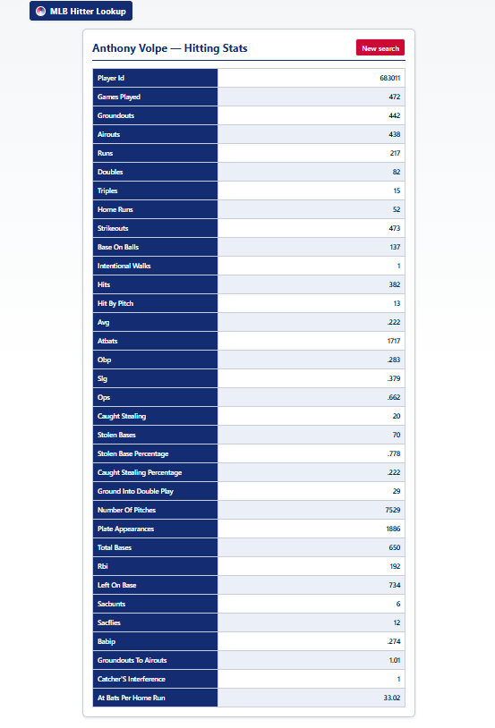
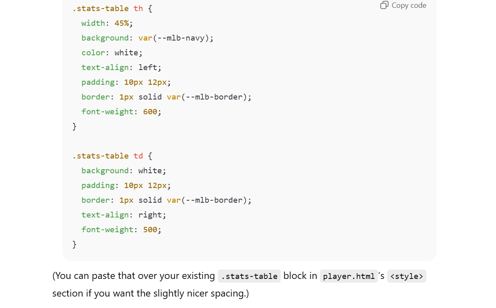

# MLB Hitter Lookup — Flask Web App

*By Jack Regan & Sophia Pak*

---

## 1. Big Idea

We both love watching sports, especially **Major League Baseball** — and we wanted a simple, clean way to instantly look up any hitter’s career or season statistics.

Most stat websites are ad‑filled or hard to navigate.
Our goal: **Enter a player’s name → instantly see their hitting stats**, cleanly formatted.

### What the app does

* Search **any MLB player** by name
* Choose **Career** or **Single Season** hitting stats
* View stats in a clean, readable table
* Get disambiguation if multiple name matches are found

### MVP

* Flask app with a single search interface
* Name → Player ID lookup
* Fetch hitting stats using the MLB Stats API
* Clean, readable stats table

### Stretch Features

* Column renaming + formatting
* Season selector
* Team‑by‑team splits
* Simple caching using JSON files

---

## 2. User Instructions (How to Use the App)

### **Using the Website**

1. Enter any MLB player’s name — e.g., **Aaron Judge**, **Mookie Betts**, **Mike Trout**
2. Choose:

   * **Career Stats**, or
   * **Season Stats** (optional: enter a year)
3. Submit → Instantly see:

   * Player profile
   * Clean hitting statistics

### **Running Locally**

#### **1. Clone the repository**

```bash
git clone https://github.com/your-repo/project.git
cd project
```

#### **2. Create a virtual environment**

```bash
python3 -m venv venv
source venv/bin/activate
```

#### **3. Install dependencies**

```bash
pip install -r requirements.txt
```

#### **4. Run the app**

```bash
python run.py
```

Then open:
**[http://127.0.0.1:5000](http://127.0.0.1:5000)**

---

## 3. Installation / Dependencies

Main libraries used:

* **Flask** — web framework
* **requests** — data fetching
* **pandas** — table formatting
* **pybaseball** — (optional early approach)
* **Jinja2** — HTML templates

See `requirements.txt` for full versions.

---

## 4. Implementation Information (How It Works)

### **Architecture Diagram (Simple)**

```
User Input → Flask Route (/player) 
          → Search Service (search_players_by_name)
          → Player Metadata (get_player_metadata)
          → Player Stats (fetch_player_stats)
          → Format & Rename Columns
          → Template Rendering (player.html)
          → HTML Output w/ Tables
```

### **Flow Summary**

1. User submits a name
2. Our `/player` route queries **MLB's StatsAPI**
3. If multiple players match → user chooses one
4. Once a player is selected:

   * Fetch metadata (name, team, position)
   * Fetch stats (career or season hitting)
   * Clean messy API column names
5. Render table with Bootstrap for readability

### **Key Code Snippet (Simplified Stats Fetching)**

```python
resp = requests.get(
    f"https://statsapi.mlb.com/api/v1/people/{player_id}/stats",
    params={"stats": scope, "group": "hitting"},
)
splits = resp.json()["stats"][0]["splits"]
df = pd.DataFrame([splits[0]["stat"]])
```

---

## 5. Results (Screenshots, Demo, Output)

### Core Features Achieved

* Fully functioning player lookup
* Player stat tables (cleaned + renamed)
* Error handling for invalid names
* Auto team logo fetching via:

```
https://www.mlbstatic.com/team-logos/team-cap-on-dark/{teamId}.svg
```

* Responsive, readable HTML tables

### Visual Example of Output




---

## 6. Project Evolution / Narrative

### **Step 1**

* Built Flask skeleton
* Implemented name → player ID search
* Returned raw stats successfully

### **Step 2**

* Added metadata (team, position, logo)
* Fixed stat column readability (renamed columns)
* Added error handling + disambiguation selection
* Improved UI using simple Bootstrap layout

### **Step 3**

* Added season selector
* Polished output format
* Cleaned up services layer
* Built README and final documentation

The project evolved from a simple API test to a clean, user‑friendly stat lookup tool.

---

## 7. Risks & Limitations

* MLB API occasionally changes structure → may require updates
* Name collisions still require user input to pick correct player
* Some old/historical players lack complete metadata
* API rate‑limits may impact heavy usage
* No database → everything refetched unless cached manually
* MLB Logo & Headshot APIs would not load due to having to download so many images

---

## 8. Future Improvements

* Full caching layer (JSON or SQLite)
* More visualizations (spray charts, stat trends, etc.)
* Pitching stats
* Dark mode UI
* Player comparison mode
* Deploy to Vercel/Netlify with API backend

---

## 9. Attribution

**APIs / Data Sources**

* MLB Stats API
* pybaseball (initial testing & fallback)

**Libraries**

* Flask
* pandas
* requests
* Jinja2
* matplotlib

**Credits**

* Project built by **Jack Regan** & **Sophia Pak**
* Thank you for a great semester Professor!
* Portions of formatting or code were brainstormed with AI assistance
  
   


---

## 10. AI Usage Disclosure

We used AI assistance (ChatGPT) for:

* Debugging certain Flask routing issues
* Formatting help for Markdown
* Small code snippets for column‑renaming

All code was reviewed, modified, and fully understood by our team.

---

##  Final Note

Thank you for checking out our project!
We hope this tool is useful to baseball fans, students, and developers alike.


